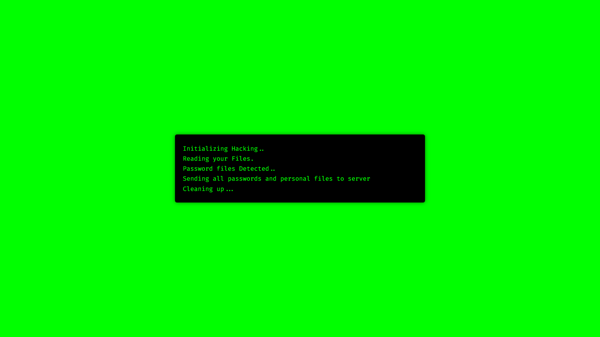

# Hacker's Terminal

Hacker's Terminal is a fun and interactive web application that simulates a hacking terminal. It displays a series of messages with a blinking cursor to mimic a real hacking experience.

## Features

- Realistic terminal interface
- Blinking cursor that moves to the end of the latest word
- Randomized message display intervals
- Easy to customize messages

## Screenshot



## Installation

1. Clone the repository:
    ```bash
    git clone https://github.com/HackesticMedusa/Hackers-Terminal.git
    ```
2. Navigate to the project directory:
    ```bash
    cd Hackers-Terminal
    ```
3. Open `index.html` in your web browser to see the terminal in action.

## Usage

To customize the messages displayed in the terminal, edit the `messages` array in `script.js`:

```javascript
const messages = [
    "Initializing Hacking...",
    "Reading your Files...",
    "Password files Detected...",
    "Sending all passwords and personal files to server...",
    "Cleaning up..."
];
```

## Contributing

Contributions are welcome! Please fork the repository and submit a pull request.

## License

This project is licensed under the MIT License. See the LICENSE file for details.